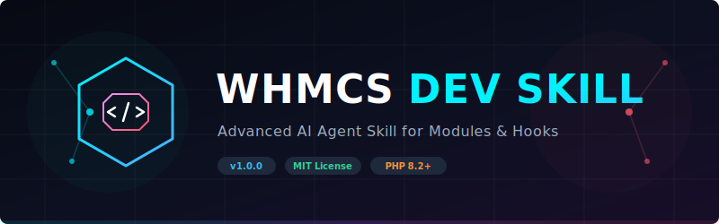

<p align="center">
  
</p>

<h1 align="center">🧠 WHMCS Dev Skill</h1>
<h3 align="center">Advanced AI Agent Skill for WHMCS Module & Hook Development</h3>

<p align="center">
  An <strong>industrial-grade developer skill file</strong> that transforms any AI coding agent into a
  <strong>Senior WHMCS Developer & Architect</strong>.
</p>

<p align="center">
  <a href="https://opensource.org/licenses/MIT"></a>
  <a href="https://www.whmcs.com"></a>
  <a href="https://www.php.net"></a>
  <a href="https://github.com/beingniloy/whmcs-dev-skill"></a>
  <a href="https://github.com/beingniloy/whmcs-dev-skill"></a>
</p>

<p align="center">
  <a href="#-quick-integration">Quick Integration</a> •
  <a href="#-what-is-this">What Is This?</a> •
  <a href="#-what-it-covers">What It Covers</a> •
  <a href="#-ide-setup-guides">IDE Setup</a> •
  <a href="#-repository-structure">Repository Structure</a> •
  <a href="#-contributing">Contributing</a>
</p>

---

## ⚡ Quick Integration

To get started, simply copy [SKILL.md](SKILL.md) to your workspace or your AI agent's global skills directory. 

### Cloning the Repository

```bash
git clone https://github.com/beingniloy/whmcs-dev-skill.git
cd whmcs-dev-skill
```

---

## 📖 What Is This?

This repository contains a highly optimized **`SKILL.md`** file — a comprehensive system instruction set designed to guide AI coding agents. When loaded into your development workspace, it instructs the agent to write production-ready, secure, compliant, and highly performant PHP code tailored for the WHMCS platform.

It is structured to be compatible with every major AI assistant, enforcing strict adherence to modern PHP standards (PHP 8.2/8.3), proper database patterns (Laravel Capsule ORM), security checklists, and WHMCS-specific APIs.

---

## ✨ What It Covers

| Category | Description & Developer Rules |
| :--- | :--- |
| 🔌 **Addon Modules** | System configs, activation schema creation, versioned upgrades, and client/admin areas. |
| 🖥️ **Provisioning Modules** | Server account provisioning, suspension, unsuspension, termination, and package upgrades. |
| 🌐 **Domain Registrars** | Domain registration, transfers, renewals, nameserver management, DNS records, and syncing. |
| 💳 **Payment Gateways** | Third-party gateways, merchant integrations, remote tokenization, and secure callbacks. |
| 🪝 **Action Hooks** | Event-driven hook configurations covering client, invoicing, module, and support lifecycles. |
| 🔗 **API Integrations** | Native internal API execution (`localAPI()`) and secure remote GuzzleHTTP call wrappers. |
| 🗄️ **Database ORM** | Secure database operations using Laravel Capsule (parameter binding, queries, transaction blocks). |
| 🎨 **Smarty Templates** | Native Bootstrap layouts built exclusively on Smarty v4 standards (deprecating `{php}`). |
| 🔒 **Security Standards** | CSRF protection (`check_token`), data encryption (`encrypt`/`decrypt`), and parameter masking. |
| 🧪 **Testing Strategy** | Mocking WHMCS environment, SQLite in-memory DB setups, and custom test bootstrapping. |
| 🎛️ **Caching & DIC** | Advanced performance caching using WHMCS's internal container cache (`\DI::make('cache')`). |
| ⚠️ **Pitfall Prevention** | Protection against common failures like raw queries, dynamic properties, and invalid scope usage. |

---

## 🤖 Compatible Agents

This skill works seamlessly with all major AI coding agents. Simply copy the `SKILL.md` file to the directory corresponding to your agent:

| Agent | Target Directory | Integration Type |
| :--- | :--- | :--- |
| **Claude Code** | `~/.claude/skills/` | Global Skill File |
| **GitHub Copilot** | `.github/` | Custom instruction: `.github/copilot-instructions.md` |
| **Cursor IDE** | `.cursor/rules/` | Project Rule File (`.mdc` format) |
| **Windsurf** | Root directory | Project memory rules: `.windsurfrules` |
| **Gemini / Custom** | `.gemini/skills/` | Workspace-level Skill |
| **Any Agent** | `.skills/` | Universal Project Skill |

---

## 🛠️ IDE Setup Guides

### 1. Claude Code
Copy the `SKILL.md` file into Claude Code's global skill directory:
```bash
mkdir -p ~/.claude/skills/whmcs-dev-skill
cp SKILL.md ~/.claude/skills/whmcs-dev-skill/
```

### 2. Cursor IDE
You can load these instructions in Cursor as a Rule:
1. Create a directory named `.cursor/rules/` in your project root.
2. Copy `SKILL.md` into it and rename it to `whmcs-dev-skill.mdc`:
   ```bash
   mkdir -p .cursor/rules
   cp SKILL.md .cursor/rules/whmcs-dev-skill.mdc
   ```
3. Alternatively, paste the contents of `SKILL.md` under **Cursor Settings** → **Rules for AI**.

### 3. GitHub Copilot (VS Code)
To apply these rules globally to Copilot in your repository:
```bash
# Save as repository-level instructions
cp SKILL.md .github/copilot-instructions.md
```

### 4. Windsurf
Create a `.windsurfrules` file in your repository root containing the contents of `SKILL.md`:
```bash
cp SKILL.md .windsurfrules
```

---

## 📁 Repository Structure

```
whmcs-dev-skill/
├── SKILL.md        # 📘 The comprehensive AI agent developer skill file
├── README.md       # 📖 This documentation file
├── LICENSE         # ⚖️ MIT License
└── .gitignore      # 🙈 Git ignore configuration
```

---

## 🔬 Key Technical Specifications Covered

- **WHMCS 9.x Compatibility:** Minimizes legacy code output; mandates PHP 8.2+ compatibility (no dynamic class properties), Smarty v4 templates (no legacy tags), and credit notes for published invoices.
- **Mocked Testing Environment:** Includes a blueprint for `tests/bootstrap.php` to define and mock global WHMCS APIs (e.g. `logActivity()`, `logModuleCall()`, `encrypt()`, `decrypt()`, `localAPI()`) so unit tests run successfully outside of WHMCS.
- **Robust Cache Implementations:** Demonstrates PSR-16 container caching (`\DI::make('cache')`) instead of invalid Laravel facade calls.
- **Static Code Quality:** Enforces PHPStan configuration along with the `krystal/whmcs-stubs` library to check code correctness.

---

## 🤝 Contributing

Contributions are always welcome! If you find any deprecated WHMCS APIs, out-of-date documentation links, or have suggestions for new code templates:

1. **Fork** the repository: `https://github.com/beingniloy/whmcs-dev-skill`
2. **Create** your feature branch: `git checkout -b feature/amazing-feature`
3. **Commit** your changes to `SKILL.md`
4. **Push** to the branch: `git push origin feature/amazing-feature`
5. **Open** a Pull Request.

---

## 👤 Author

**Niloy**
- 🌐 Website: [niloy.io](https://niloy.io)
- 🐙 GitHub: [@beingniloy](https://github.com/beingniloy)

---

## 📄 License

This project is licensed under the **MIT License** - see the [LICENSE](LICENSE) file for details.

---

<p align="center">
  Built with ❤️ for the WHMCS developer community.
  <br/>
  <sub>If this helped you, consider giving it a ⭐ on GitHub!</sub>
</p>
